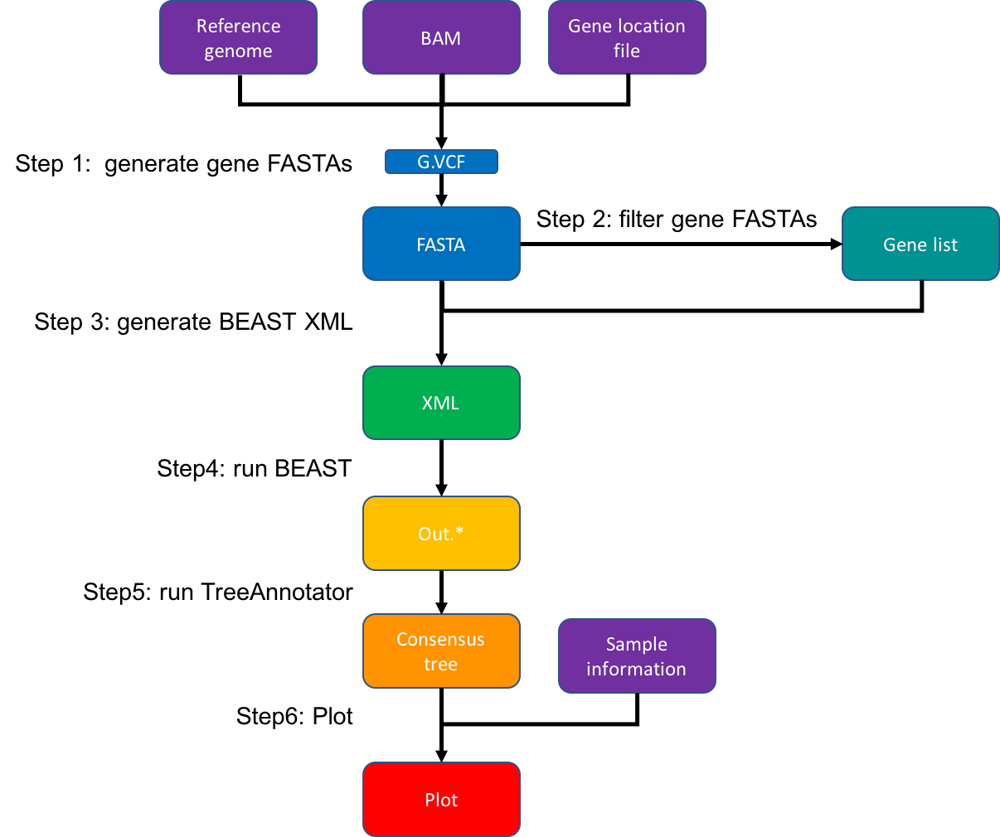
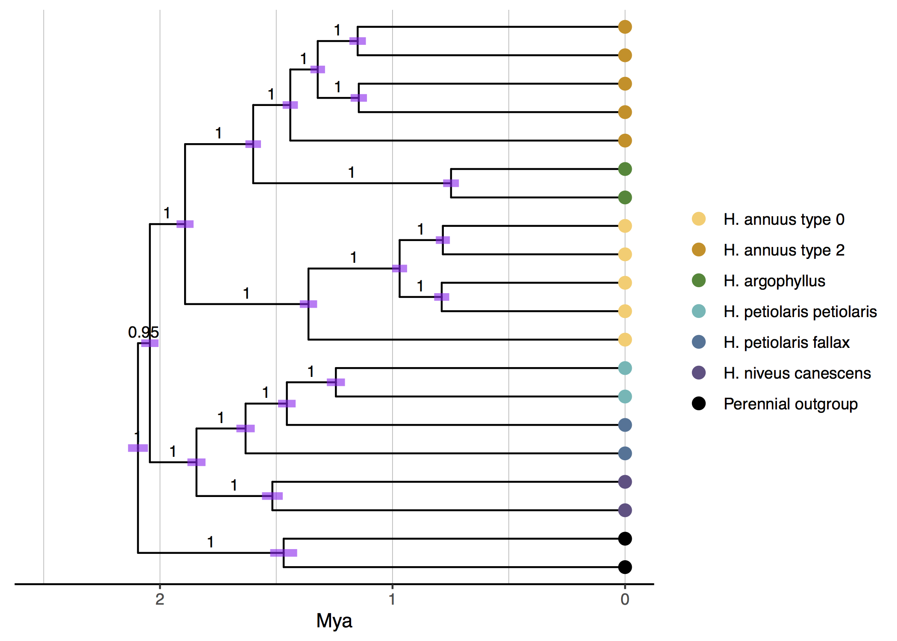

[](http://www.gnu.org/licenses/gpl-3.0)

# Molecular dating with BEAST

This repository is made for eBook entitled “Bioinformatics Recipes for Plant Genomics: Data, Code, and Workflows” in [Bio-101](https://cn.bio-protocol.org/bio101/default.aspx)

## Overview of an example workflow

This is an example workflow to construct gene tree and perform molecular dating using BEAST.



## Installation

- __Running environment__: 
    - The workflow was constructed based on __Linux CentOS__ 7.7.1908 with OpenJDK Runtime Environment v1.8.0_242.

- __Required software and versions__: 

    - [GATK](https://gatk.broadinstitute.org/) (v4.0.8.1)
    - [samtools](http://www.htslib.org/doc/samtools.html) (v1.3)
    - [Perl](http://www.perl.org/) (v5.16.3)
    - [BEAST](https://beast.community/) (v1.10.4)
    - [BEAGLE](https://github.com/beagle-dev/beagle-lib) (v3.1.1)
    - [R](https://www.r-project.org/) (version 3.6.2)
    - [RStudio](https://rstudio.com/) (version 1.1.463)
    - [ggtree](http://bioconductor.org/packages/release/bioc/html/ggtree.html) (v3.1.3.992)
    - [treeio](https://github.com/YuLab-SMU/treeio) (v1.17.2)
    - [tidyverse](https://www.tidyverse.org) (version 1.3.0)

To download a pre-built version of GATK
```
cd program/
wget https://github.com/broadinstitute/gatk/releases/download/4.0.8.1/gatk-4.0.8.1.zip
unzip gatk-4.0.8.1.zip
cd gatk-4.0.8.1/
./gatk # check
cd ../../
```

To download and install BEAGLE and BEAST
```
# BEAGLE
cd lib/
wget https://github.com/beagle-dev/beagle-lib/archive/refs/tags/v3.1.1.tar.gz
tar -zxvf v3.1.1.tar.gz
cd beagle-lib-3.1.1/
./autogen.sh
./configure --prefix=$PWD
make install
ll lib # check
cd ../../
BEAGLE_PATH=$PWD/lib/beagle-lib-3.1.1/lib/ # save the absolute path for BEAST
# BEAST
cd program/
wget https://github.com/beast-dev/beast-mcmc/releases/download/v1.10.4/BEASTv1.10.4.tgz
tar -zxvf BEASTv1.10.4.tgz
cd BEASTv1.10.4/bin
export LD_LIBRARY_PATH=$BEAGLE_PATH:$LD_LIBRARY_PATH
./beast -beagle_info # check
cd ../../../
```


## Input Data

#### 1. BAM files and reference genome
The input BAM files `bam/*.bam` are compressed binary versions of SAM files that represent aligned sequences of the samples to the [reference genome](https://gatk.broadinstitute.org/hc/en-us/articles/360035891071-Reference-genome). 
BAM/SAM is commonly used to represent sequence alignment of next-generation sequencing data. Specification of the format can be found [here](https://samtools.github.io/hts-specs/SAMv1.pdf). 
You can generate BAM files for your samples with most alignment tools such as bwa or bowtie. 
We will start from these files and generate site-by-site [GVCF files](https://gatk.broadinstitute.org/hc/en-us/articles/360035531812-GVCF-Genomic-Variant-Call-Format) for making gene sequence files. 

#### 2. Sample information
The file `input/sample_info.txt` a tab-delimited file containing the names and group assignments of the samples. The group assignment will be used for plotting.
The first ten rows of the file:
```
ANN0955	Ann-0
ANN0803	Ann-0
ANN0979	Ann-0
HT170_SD2W-14	Ann-0
ANN1272	Ann-0
HT219_SD2W-38	Ann-2
ANN1374	Ann-2
ANN1146	Ann-2
ANN1159	Ann-2
ANN0870	Ann-2
```
The first 5 samples are from species `Ann` with genotype 0/0 of the focal chromosomal inversion (group 0), and the next 5 samples are from species `Ann` with genotype 1/1 (group 2). We also include 2 samples from each of other related (sub)species and the outgroup. 

#### 3. Locations of focal genes within the region
The file `input/genes.locations.txt` is a tab-delimited file with the following columns: gene name (strings without spaces), chromosome, start and end (in bp, based on the reference genome). It will be used to extract gene sequences from BAM files.
The first five rows of the example data:
```
gene_1	HanXRQChr17	27130172	27133822
gene_2	HanXRQChr17	191345873	191353428
gene_3	HanXRQChr17	191494056	191496274
gene_4	HanXRQChr17	193856630	193871419
gene_5	HanXRQChr17	193971597	193974985
```


## Major steps

#### Step 1:  generate FASTA files for the genes from BAM
```
gatk="program/gatk-4.0.8.1/gatk"
ref="input/HanXRQr1.0-20151230.fa"
BAM_DIR="input/bam"
# Index the reference for GATK
samtools faidx $ref
$gatk CreateSequenceDictionary --java-options -Xmx2G -R $ref
# Index the BAM files for GATK
for bam in `ls $BAM_DIR/*.bam`
do
samtools index $bam
done
ll input/bam/*.bam.bai
# Generate gene FASTAs from BAMs
while read gene_name chr start end
do
	if [ ! -s "cache/$gene_name.fasta" ]
	then
		echo -e "$chr\t$start\t$end" > cache/tmp.$gene_name.bed
		cut -f1 input/sample_info.txt | parallel -j 10 bash script/make_fasta.sh $BAM_DIR $ref $gene_name
		for f in cache/tmp.$gene_name.*.fa; do (cat "${f}"; echo); done > cache/$gene_name.fasta
		rm cache/tmp.*.bed cache/tmp.*.*.g.vcf* cache/tmp.*.*.fa
	fi
done < input/genes.locations.txt
```
This step first produces a `g.vcf` for each gene for each sample from the BAM file using `gatk HaplotypeCaller`. The parameter `-ERC BP_RESOLUTION` outputs the genotype calls site by site, which will ease the conversion of `g.vcf` to FASTA format using the custom script `script/gvcf2fasta_nogaps.pl`.
A FASTA will be generated in `cache/` for each gene with sequences of all samples. Check if the numbers of sequences are correct: 
```
ls cache/gene_*.fasta | wc -l # 82 genes in total
wc -l cache/gene_*.fasta # should be 40 (20 sequences in each FASTA) for all genes
```

#### Step 2: filter gene FASTAs
We filter the genes based on individual and average missing rates across samples and generate a gene list for phylogenetic analysis
```
cut -f1 input/genes.locations.txt | perl script/filter_phylo_genes.pl > cache/phylo_genes.list
```
Check the numbers of genes that pass the filter: 
```
wc -l cache/phylo_genes.list # 40 out of 82 genes kept
```

#### Step 3: generate the BEAST XML
```
# FASTA list
cat cache/phylo_genes.list | sed 's/$/&.fasta/g' | sed 's/^/cache\//g' > cache/gene_fastas.list
# Generate the XML file for BEAST v1 using custom script
perl script/fastas2BEAST1xml.pl \
	--fastaList cache/gene_fastas.list \
	--chainLength 1000000 \
	--screenEcho 1000 \
	--fileLog 100 \
	--out output/out
```
Here we set the number of steps of MCMC (`--chainLength`) to be 1M and set the parameter values to be displayed on the screen (`--screenEcho`) every 1k steps and recorded in the log file (`--fileLog`) every 100 steps.
This will generate `output/out.xml`, which BEAST will use to run the analysis.

#### Step 4: run BEAST on command line
```
BEAGLE_PATH=$PWD/lib/beagle-lib-3.1.1/lib/ # specify the path to the BEAGLE library
export LD_LIBRARY_PATH=$BEAGLE_PATH:$LD_LIBRARY_PATH
program/BEASTv1.10.4/bin/beast -threads 30 output/out.xml
```
This is the main command of BEAST. It takes 1-2h with 30 threads. This step will generate `output/out.log`, `output/out.trees` and `output/out.ops`.

#### Step 5: construct a consensus tree using TreeAnnotator
We assume that the phylogenetic MCMC in BEAST reach convergence after 10k runs. We then create a maximum clade credibilty (MCC) tree summarizing the posterior tree distribution using the program TreeAnnotator within the BEAST package.
```
program/BEASTv1.10.4/bin/treeannotator -burnin 100000 -heights median output/out.trees output/out.mcc.tre
```
This will generate the file `output/out.mcc.tre` that contains a consensus tree as well as other information of phylogenetic analysis in BEAST.

#### Step 6: plot the results
```
Rscript script/plot_beast.R
```

## Expected results



## License
It is a free and open source software, licensed under [GPLv3](https://github.com/github/choosealicense.com/blob/gh-pages/_licenses/gpl-3.0.txt).
